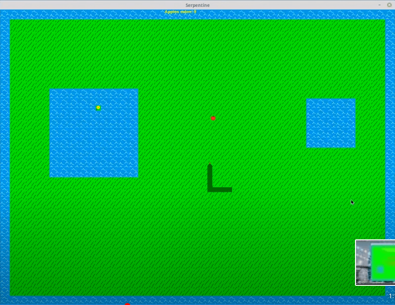

<h1>Serpentine</h1>
<h3>Dependencies</h3>
<ul><li>Python</li>
<li>PyGame</li></ul>
<h3>Description</h3>

 This was one of my very first coding projects in Python, which came mostly from tutorials. I 
created the basic "snake game" we are familiar with from the 1970s, then added additional content such as
multiple randomly generated water traps, colors, textures, sound effects, music, etc. The water
animation effect runs on a seperate thread, which I was quite pleased with at the time considering
  how new to coding I was. This project is complete. The folder titled "<b>dist</b>" contains an 
installer for the 32-bit version of the game for Windows. Enjoy! 

<h3>Screen Shot</h3>

